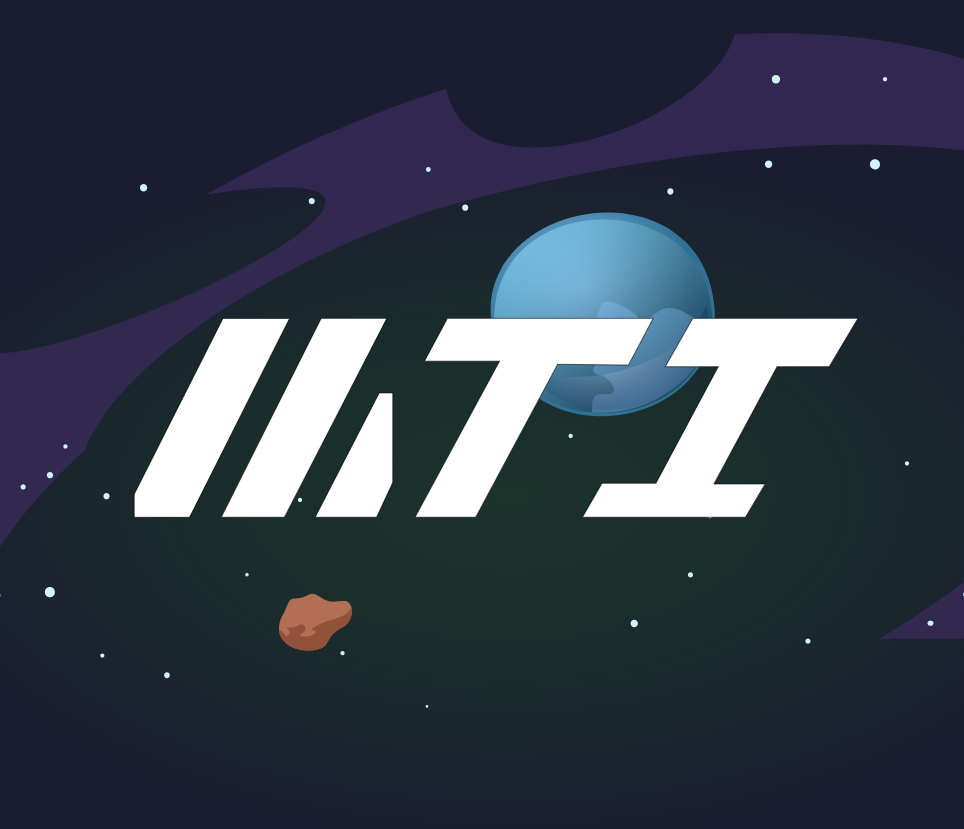

<br/>
<p align="center">
  <a href="https://github.com/Madis-Touch-Industries/codex">
    
  </a>

  <h3 align="center">Madis Touch Codex</h3>

  <p align="center">
    A great way to get familiar with Dual Universe
    <br/>
    <br/>
    <a href="https://github.com/Madis-Touch-Industries/codex">View Demo</a>
    .
    <a href="https://github.com/Madis-Touch-Industries/codex/issues">Report Bug</a>
    .
    <a href="https://github.com/Madis-Touch-Industries/codex/issues">Request Feature</a>
  </p>
</p>
<center>
   </center>

## Table Of Contents

- [Built With](#built-with)
- [Getting Started](#getting-started)
  - [Prerequisites](#prerequisites)
  - [Installation](#installation)
- [Usage](#usage)
- [Roadmap](#roadmap)
- [Contributing](#contributing)
- [License](#license)
- [Authors](#authors)
- [Acknowledgements](#acknowledgements)

## Built With

This website is built using [Docusaurus 2](https://docusaurus.io/), a modern static website generator.

## Getting Started

This is an example of how you may give instructions on setting up your project locally.
To get a local copy up and running follow these simple example steps.

### Prerequisites

This is an example of how to list things you need to use the software and how to install them.

- Yarn

```sh
npm install -g yarn
```

### Installation

1. Clone the repo

```sh
git clone https://github.com/Madis-Touch-Industries/codex.git
```

2. Install packages

```sh
yarn
```

3. Run the Development server

```sh
yarn start
```

## Usage

Use this space to show useful examples of how a project can be used. Additional screenshots, code examples and demos work well in this space. You may also link to more resources.

_For more examples, please refer to the [Documentation](https://docusaurus.io/docs/creating-pages)_

## Roadmap

See the [open issues](https://github.com/Madis-Touch-Industries/codex/issues) for a list of proposed features (and known issues).

## Contributing

Contributions are what make the open source community such an amazing place to be learn, inspire, and create. Any contributions you make are **greatly appreciated**.

- If you have suggestions for adding or removing projects, feel free to [open an issue](https://github.com/Madis-Touch-Industries/codex/issues/new) to discuss it, or directly create a pull request after you edit the _README.md_ file with necessary changes.
- Please make sure you check your spelling and grammar.
- Create individual PR for each suggestion.

### Creating A Pull Request

1. Fork the Project
2. Create your Feature Branch (`git checkout -b feature/AmazingFeature`)
3. Commit your Changes (`git commit -m 'Add some AmazingFeature'`)
4. Push to the Branch (`git push origin feature/AmazingFeature`)
5. Open a Pull Request

## License

Distributed under the MIT License. See [LICENSE](https://github.com/Madis-Touch-Industries/codex/blob/main/LICENSE.md) for more information.

## Authors

- **Snipey** - _Lead Developer_

## Acknowledgements

- [Dual Universe](https://dualuniverse.game)
- [ImgShields](https://shields.io/)
